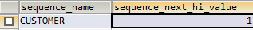

## JPA之TABLE主键生成策略
`准备工作:`

需要在数据库中创建一张第三方主键生成表，JPA会通过该表和注解元信息自动生成对应的主键值。
**`注意: 如果没有手动创建该主键生成表，程序会报错且JPA会自动生成名为hibernate_sequences的第三方表，该表没有任何作用。其内容如下:`**



测试SQL代码如下:

```sql
# ----创建主键生成表
CREATE TABLE PK_GENERATOR_TABLE(
`PK_COLUMN` VARCHAR(255),
`PK_VALUE` VARCHAR(255)
)

# ---- 插入主键生成表数据
INSERT INTO PK_GENERATOR_TABLE(`PK_COLUMN`,`PK_VALUE`) VALUES('ID_CUSTOMER','1');
```

创建的主键生成表如下:

PK_COLUMN | PK_VALUE
----------|-----------
ID_CUSTOMER|    1

JPA注解代码如下:

```java
//标注ID的则视为主键
@Id
//配置生成主键策略
@TableGenerator(name="ID_CUSTOMER",
allocationSize=1,
table="PK_GENERATOR_TABLE",
pkColumnName="PK_COLUMN",
pkColumnValue="ID_CUSTOMER",
valueColumnName="PK_VALUE")
@GeneratedValue(strategy=GenerationType.TABLE,generator="ID_CUSTOMER")
```

`TableGenerator`注解的`name`属性值对应`GeneratedValue`注解的`generator`属性值。
`GeneratedValue`的`strategy`属性指定生成策略为`TABLE`,此时表示该主键ID采用第三方表来生成。
现对`TableGenerator`注解各属性解释如下:

属性名  |  解释
-------|--------
name   | 对应GeneratedValue的generator属性值。通过俩者将其互相关联
allocationSize| 分配大小，指主键增长步长。这里指定为1，则意思是主键每次增长为1。
table | 对应第三方主键生成表名[代表JPA将使用哪个第三方表来主键值得计算]
pkColumnName | 指定第三方表中对应的某个列名
pkColumnValue | 指定第三方表中对应的某个列的值，某个列指 pkColumnName属性中的指定的列名
valueColumnName | 指定生成的列名[对应第三方表的另外一个列值]

JPA通过`pkColumnName`、`pkColumnValue`和`valueColumnName`三个属性中的值对应出第三方表的各个列和值来得出要是使用的哪个点。