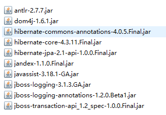
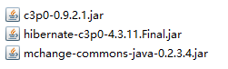
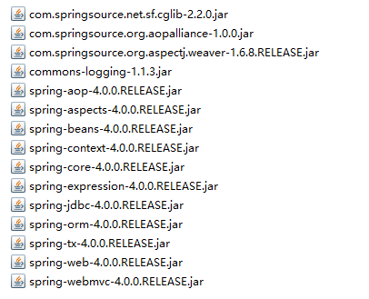

## JPA与Spring的简单整合

**`spring配置文件`**

```xml
<?xml version="1.0" encoding="UTF-8"?>
<beans xmlns="http://www.springframework.org/schema/beans"
       xmlns:xsi="http://www.w3.org/2001/XMLSchema-instance"
       xmlns:context="http://www.springframework.org/schema/context" 
       xmlns:tx="http://www.springframework.org/schema/tx"
       xsi:schemaLocation="http://www.springframework.org/schema/beans
       http://www.springframework.org/schema/beans/spring-beans.xsd 
       http://www.springframework.org/schema/context 
       http://www.springframework.org/schema/context/spring-context.xsd 
       http://www.springframework.org/schema/tx http://www.springframework.org/schema/tx/spring-tx.xsd">

    <!--spring包扫描-->
    <context:component-scan base-package="com.heiketu"/>

    <!--导入外部文件-->
    <context:property-placeholder location="classpath:db.properties"/>

    <!--配置数据源-->
    <bean id="dataSource" class="com.mchange.v2.c3p0.ComboPooledDataSource">
        <property name="user" value="${jdbc.user}"/>
        <property name="password" value="${jdbc.pass}"/>
        <property name="jdbcUrl" value="${jdbc.url}"/>
        <property name="driverClass" value="${jdbc.driver}"/>
    </bean>

    <!--配置entityManagerFactory-->
    <bean id="entityManagerFactory" class="org.springframework.orm.jpa.LocalContainerEntityManagerFactoryBean">
        <property name="dataSource" ref="dataSource"/>
        <!--配置 JPA 提供商的适配器. 可以通过内部 bean 的方式来配置-->
        <property name="jpaVendorAdapter">
            <bean class="org.springframework.orm.jpa.vendor.HibernateJpaVendorAdapter"/>
        </property>
        <!--配置实体所在包-->
        <property name="packagesToScan" value="com.heiketu.pojo"/>
        <property name="jpaProperties">
            <props>
                <prop key="hibernate.show_sql">true</prop>
                <prop key="hibernate.format_sql">true</prop>
                <prop key="hibernate.hbm2ddl.auto">update</prop>
            </props>
        </property>
    </bean>

    <!--配置事物管理器-->
    <bean id="transactionManager" class="org.springframework.orm.jpa.JpaTransactionManager">
        <property name="entityManagerFactory" ref="entityManagerFactory"/>
    </bean>

    <!--配置支持注解的事物管理-->
    <tx:annotation-driven transaction-manager="transactionManager" />

</beans>
```

`数据源的properties`

```properties
jdbc.user=root
jdbc.pass=admin
jdbc.url=jdbc:mysql:///test?serverTimezone=GMT%2B8
# com.mysql.cj.jdbc.Driver -> MySQL7.0以上的版本驱动class 有所更改
jdbc.driver=com.mysql.jdbc.Driver
```

`Spring`中使用`JPA`:
在Dao层通过`@PersistenceContext`注解，获取到`EntityManager`即可使用JPA，代码如下:

```java
@Repository
public class TestDao {

    @PersistenceContext
    private EntityManager entityManager;

    public void save(TestClass testClass){
        entityManager.persist(testClass);
    }

}
```

`@Repository`容器为`Spring`容器的注解，使用该注解将该Dao加入到spring容器，交由Spring来管理。

JPA与Spring整合使用到的测试Jar包示例如下:

**`hiberante的JPA实现所需Jar包:`**

`required目录下`



`c3p0数据源`



`JPA规范包`


`Spring相关Jar包`:



`MySQL驱动包`


