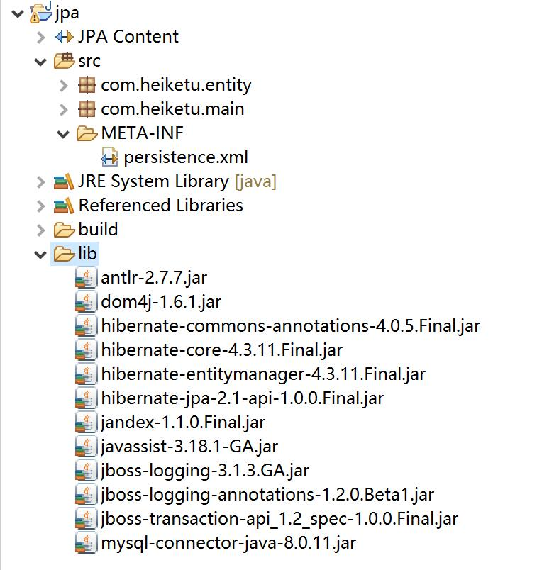

## JPA入门之HelloWorld

准备jar包:
	
	|---antlr-2.7.7.jar
	|---dom4j-1.6.1.jar
	|---hibernate-commons-annotations-4.0.5.Final.jar
	|---hibernate-core-4.3.11.Final.jar
	|---hibernate-entitymanager-4.3.11.Final.jar
	|---hibernate-jpa-2.1-api-1.0.0.Final.jar
	|---jandex-1.1.0.Final.jar
	|---javassist-3.18.1-GA.jar
	|---jboss-logging-3.1.3.GA.jar
	|---jboss-logging-annotations-1.2.0.Beta1.jar
	|---jboss-transaction-api_1.2_spec-1.0.0.Final.jar
	|---mysql-connector-java-8.0.11.jar

项目结构如图:



实例采用hibernate的JPA实现。
JPA项目中`persistence.xml`文件必须放在`META-INF`目录下。[整合spring文件后，`persistence.xml`文件可以抽取出来或不需要]

配置文件`persistence.xml`内容结构如下:

```xml
<?xml version="1.0" encoding="UTF-8"?>
<persistence version="2.1" xmlns="http://xmlns.jcp.org/xml/ns/persistence" xmlns:xsi="http://www.w3.org/2001/XMLSchema-instance" xsi:schemaLocation="http://xmlns.jcp.org/xml/ns/persistence http://xmlns.jcp.org/xml/ns/persistence/persistence_2_1.xsd">
	<persistence-unit name="jpa" transaction-type="RESOURCE_LOCAL">
	
		<!-- 配置什么ORM产品，来作为JPA的实现 
			 实际上是配置 javax.persistence.spi.PersistenceProvider接口的实现类
			 若JPA项目中只有一个JPA的实现产品，则可以不用配置该节点。
		-->
		<provider>org.hibernate.ejb.HibernatePersistence</provider>
		<class>com.heiketu.entity.Customer</class>
		<properties>
			<!-- 数据库相关连接设置 -->
			<property name="javax.persistence.jdbc.driver" value="com.mysql.cj.jdbc.Driver"/>
			<property name="javax.persistence.jdbc.url" value="jdbc:mysql:///test?serverTimezone=GMT%2B8"/>
			<property name="javax.persistence.jdbc.user" value="root"/>
			<property name="javax.persistence.jdbc.password" value="admin"/>
			
			<!-- 配置JPA实现产品的基本属性: hibernate基本配置 -->
			<property name="hibernate.format_sql" value="true"/>
			<property name="hibernate.show_sql" value="true"/>
			<property name="hibernate.hbm2ddl.auto" value="update"/>
			<!-- <property name="hibernate.dialect" value="org.hibernate.dialect.MySQLDialect"/> -->
			
		</properties>
	</persistence-unit>
</persistence>
```

配置文件中内容与hibernate的核心配置文件内容大致相似。

接下来新建一个实体类:

```java
package com.heiketu.entity;

import javax.persistence.Column;
import javax.persistence.Entity;
import javax.persistence.GeneratedValue;
import javax.persistence.GenerationType;
import javax.persistence.Id;
import javax.persistence.Table;

@Table(name="CUSTOMER")
@Entity
public class Customer {
	//标注ID的则视为主键
	@Id
	//配置生成主键策略
	@GeneratedValue(strategy=GenerationType.AUTO)
	private Integer id;
	private String name;
	private String address;
	public Integer getId() {
		return id;
	}
	public void setId(Integer id) {
		this.id = id;
	}
	
	@Column(name="name",length=20,nullable=false)
	public String getName() {
		return name;
	}
	public void setName(String name) {
		this.name = name;
	}
	public String getAddress() {
		return address;
	}
	public void setAddress(String address) {
		this.address = address;
	}
}
```

这里采用了java的jdk5.0开始支持的annotation注解,使用了JPA元注解。

测试代码如下:

```java
	/**
	 * 使用JPA的几个步骤:
	 * 1. 创建EntityManagerFactory
	 * 2. 创建EntityManager
	 * 3. 开启事务
	 * 4. 持久化操作
	 * 5. 提交事务
	 * 6. 关闭事务
	 * 7. 关闭EntityManager
	 * 8. 关闭EntityManagerFactory
	 */
	String persistenceUnitName = "jpa";
	EntityManagerFactory entiyManagerFactory = Persistence.createEntityManagerFactory(persistenceUnitName);
	EntityManager entityManager = entiyManagerFactory.createEntityManager();
	
	EntityTransaction transaction = entityManager.getTransaction();
	//开启事务
	transaction.begin();
	
	Customer customer = new Customer();
	customer.setName("中国门");
	customer.setAddress("万里云");
	entityManager.persist(customer);
	//提交事务
	transaction.commit();
	entityManager.close();
	entiyManagerFactory.close();
```

总结:
使用JPA有如下步骤:
- 创建EntityManagerFactory
- 创建EntityManager
- 开启事务
- 持久化操作[自己的业务持久化操作]
- 提交事务
- 关闭事务
- 关闭EntityManager
- 关闭EntityManagerFactory

对元注解粗略解释如下:

注解名 | 解释
---|----
Table | 对应数据库的表.
Entity | 表示该类为实体类对应数据库的一张数据表
Id | 表示该属性对应数据表的主键字段
GeneratedValue | 配合Id注解使用，表示主键的生成策略[strategy有以下几中选项:AUTO(程序自动选择生成策略)、IDENTITY(MySQL数据库支持，但Oracle不支持)、SEQUENCE(Oracle支持的序列,MySQL不支持)、TABLE(采用第三张表来组合成自增长主键)]
Column | 在属性的get方法中使用，表示该列对应数据表中的一个字段。该属性有较多属性来支持对应的数据库字段的特性[例如:长度、对应的字段名、唯一约束等等]
Base | 默认JPA给字段添加的注解，如果没有添加任何注解会自动采用Base注解方案。JPA会自动对应数据表中的列 
Transient | 表示该字段不持久化至数据库中，也不会在数据表中生成对应的列。
Temporal | 一般配合Java的Date类型字段使用。生成对应的日期类型几种形式:Date[只有年月日]、TIME[只有时分秒]、TIMESTAMP[时间戳:生成年月日时分秒]